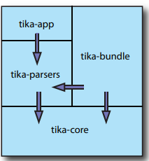
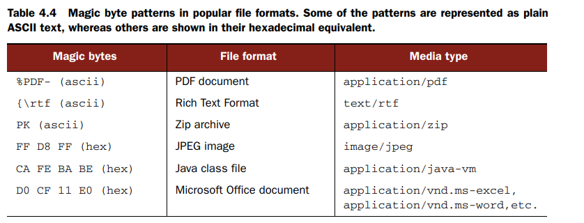
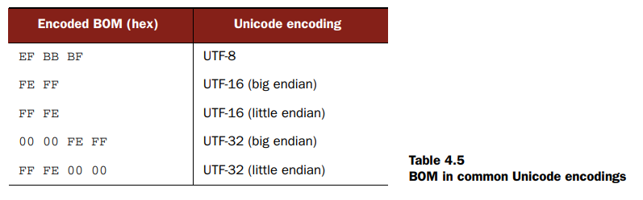

# documents-parsing

Using Java APIs to create/edit and process documents (Word, Excel, Txt ...)

* Apache POI
* Apache TIka
* Jackson FasterXML
* JSON (Gson,Jackson,json-simple)

### POI

For basic (PDF complex) related stuff.

### Tika



C-like mime type:
```xml
<mime-type type="text/x-c">
    <glob pattern="*.c"/>
    <glob pattern="*.cc"/>
    <glob pattern="*.cxx"/>
    <glob pattern="*.cpp"/>
    <glob pattern="*.h"/>
    <glob pattern="*.hh"/>
    <glob pattern="*.dic"/>
    <sub-class-of type="text/plain"/>
</mime-type>
```
## Tika
CLI:
```zsh
java -jar tika-app-1.0.jar < document.doc > extracted-text.xhtml

cat document.doc | java -jar tika-app-1.0.jar | grep some-text
```

from web:

```bash
java -jar tika-app-1.0.jar http://www.example.com/document.doc
```

#### Magic bytes




